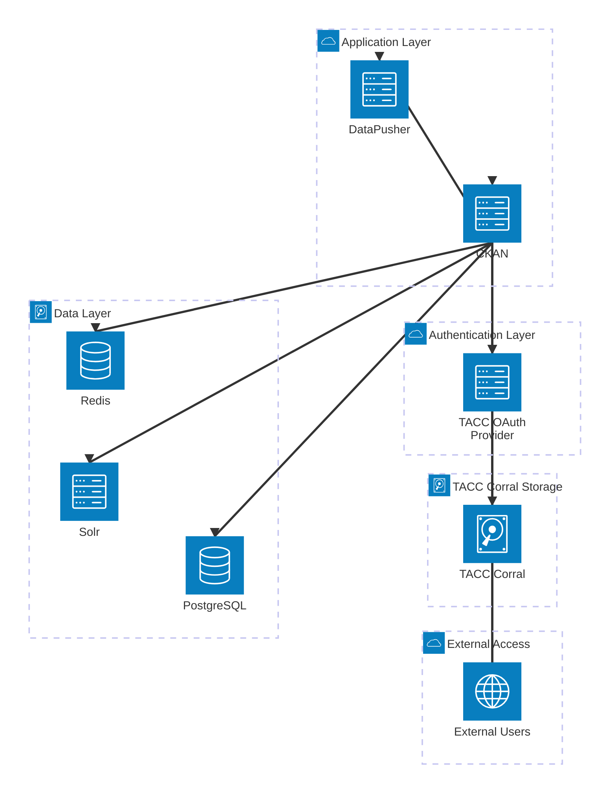

# CKAN Architecture Diagram

This document contains Mermaid architecture diagrams for the CKAN deployment.

## Architecture Overview

The CKAN deployment follows a multi-layered architecture designed for scalability, security, and efficient data management. The system is organized into distinct functional layers:

**External Access Layer**: This layer handles all incoming requests from external users and client applications. It serves as the entry point for web interfaces, API calls, and authentication requests.

**Application Layer**: Contains the core CKAN services that process requests and manage data operations. The CKAN server handles web requests, API endpoints, and coordinates with other services, while the DataPusher service processes and validates uploaded datasets.

**Authentication Layer**: Houses the OAuth provider that integrates with TACC Account services for user authentication and authorization. This layer ensures secure access control through TACC's centralized identity management system, providing token-based authentication for API access and user sessions.

**Data Layer**: Consists of the persistent storage services that maintain application state and search capabilities. PostgreSQL serves as the primary relational database for metadata and configuration, Solr provides full-text search and indexing capabilities, and Redis handles caching and session management for improved performance.

**TACC Corral Storage**: An external high-performance file system that stores the actual dataset files. [TACC Corral](https://tacc.utexas.edu/systems/corral/) provides scalable, reliable storage separate from the application databases for metadata.

The architecture ensures data flows efficiently from external users through the application layer to the appropriate storage systems, with OAuth providing secure authentication throughout the process.

> **Deployment Note**: All services (CKAN, DataPusher, PostgreSQL, Solr, and Redis) are containerized and deployed using Docker Compose as defined in [docker-compose.yml](docker-compose.yml). The TACC OAuth Provider and TACC Corral are external services that integrate with the containerized CKAN deployment.

## Architecture with OAuth

## Service Details

### Current Services

- **CKAN**: Main application server (port 5000)
- **DataPusher**: Data processing service (port 8800)
- **PostgreSQL**: Primary database
- **Solr**: Search and indexing (port 8983)
- **Redis**: Caching and session storage
- **TACC Corral**: External file system for data storage ([TACC Corral](https://tacc.utexas.edu/systems/corral/))

### With OAuth Addition

- **TACC OAuth Provider**: Authentication service integrated with TACC Account system
- **External Users**: Client applications and end users
